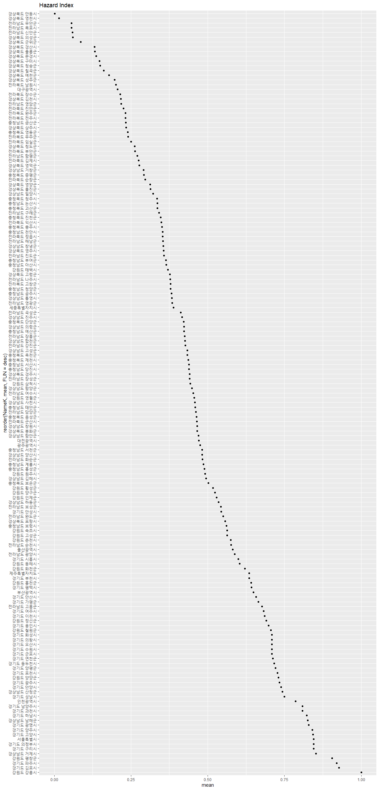
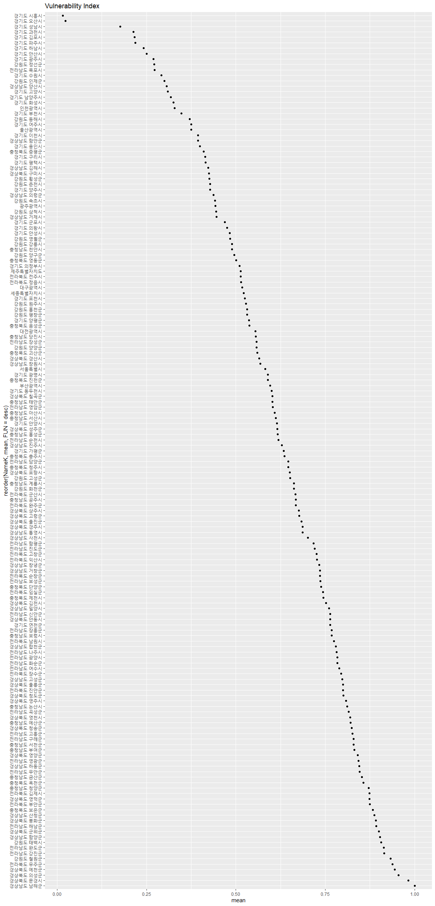

```r
library(rgdal)
library(sf)
library(lwgeom) #st_make_valid
library(tmap)
library(tidyverse)
```

#### **열 명칭별 의미**
모든 항목 및 지표들은 표준화 적용 완료

* Name : 영문 시군명 (161개)
* NameK : 국문 시군명 (161개)
* SGG : 시군코드 
* X16_hazard : 16년도 hazard 지수(확률강우량)  
* X17_hazard : 17년도 hazard 지수(확률강우량)    
* X18_hazard : 18년도 hazard 지수(확률강우량)  
* X16_ex : 16년도 exposure 지수
* X17_ex : 17년도 exposure 지수 
* X16_ex_str : 16년도 총건축물수
* X16_ex_pop : 16년도 총인구수
* X16_ex_eco : 16년도 평균공시지가 
* X16_vul : 16년도 vulnerability 지수
* X17_vul : 17년도 vulnerability 지수
* X16_vul_phy : 16년도 노후건축물비율
* X16_vul_soc : 16년도 의존인구비율
* X16_cap : 16년도 capacity 지수
* X17_cap : 17년도 capacity 지수
* X18_cap : 18년도 capacity 지수
* X16_cap_phy : 16년도 방재시설 개수
* X16_cap_soc : 16년도 소방경찰관서수 밀도
* X16_cap_eco : 16년도 방재예산액
* X16_result : 16년도 홍수피해위험지수
* X17_result : 17년도 홍수피해위험지수
 


```r
# 시군 shp file 불러오기
analysis <- rgdal::readOGR('input/analysis.shp')
```

```
## OGR data source with driver: ESRI Shapefile 
## Source: "C:\00_R\0_Git\KRM_Qual\input\analysis.shp", layer: "analysis"
## with 161 features
## It has 34 fields
```

```r
analysis_sf <- st_as_sf(analysis)
# polygon error check
# st_is_valid(analysis_sf)
analysis_sf <- st_make_valid(analysis_sf)
# st_is_valid(analysis_sf)
# tmap loading 과 그림속도 증가를 위해 polygon simplify
analysis_simp <- st_simplify(analysis_sf, dTolerance = 50)
```

속성 확인


```r
# summary(analysis_simp)
# str(analysis_simp)
```

```r
tm_shape(analysis_simp)+
  tm_fill("NameK")+
  tm_borders()+
  tmap_options(max.categories = 161)
```

<!-- -->

**분류**


```r
result <- c("X16_result", "X17_result")
haz <- c("X16_hazard", "X17_hazard", "X18_hazard")
expo <- c("X16_ex", "X17_ex")
vul <- c("X16_vul", "X17_vul")
cap <- c("X16_cap", "X17_cap", "X18_cap")
```

```r
breaks <-  c(0, 0.2, 0.4, 0.6, 0.8, 1)
tm_shape(analysis_simp)+
  tm_polygons(result, breaks=breaks, palette="Reds")+
  tm_layout(title = "홍수위험지수")+
  tm_facets(nrow=1)
```

<!-- -->

```r
tm_shape(analysis_simp)+
  tm_polygons(haz, breaks=breaks, palette="Oranges")+
  tm_layout(title = "Hazard Index")+
  tm_facets(nrow=1)
```

<!-- -->

```r
tm_shape(analysis_simp)+
  tm_polygons(expo, breaks=breaks, palette="Greens")+
  tm_layout(title="Exposure Index")+
  tm_facets(nrow=1)
```

<!-- -->

```r
tm_shape(analysis_simp)+
  tm_polygons(vul, breaks=breaks)+
  tm_layout(title="Exposure Index")+
  tm_facets(nrow=1)
```

<!-- -->

```r
tm_shape(analysis_simp)+
  tm_polygons(cap, breaks=breaks, palette="Blues")+
  tm_layout(title="Capacity Index")+
  tm_facets(nrow=1)
```

<!-- -->

***
**Geometry만 제거하고 분석을 시작**


```r
analysis_df <- st_drop_geometry(analysis_simp)
```

```r
# 홍수피해위험지수
analysis_df %>% 
  select(NameK, all_of(result)) %>% 
  pivot_longer(all_of(result), names_to="year", values_to="hazard") %>% 
  group_by(NameK) %>% 
  summarise(mean=mean(hazard)) %>% 
  ggplot(aes(
    x=reorder(NameK, mean, FUN=desc),
    y=mean))+
  geom_point()+
  coord_flip()+
  labs(title = "홍수피해위험지수")
```

<!-- -->

```r
# hazard 지수
analysis_df %>% 
  select(NameK, all_of(haz)) %>% 
  pivot_longer(all_of(haz), names_to="year", values_to="hazard") %>% 
  group_by(NameK) %>% 
  summarise(mean=mean(hazard)) %>% 
  ggplot(aes(
    x=reorder(NameK, mean, FUN=desc),
    y=mean))+
  geom_point()+
  coord_flip()+
  labs(title = "Hazard Index")
```

<!-- -->

```r
# exposure 지수
analysis_df %>% 
  select(NameK, all_of(expo)) %>% 
  pivot_longer(all_of(expo), names_to="year", values_to="hazard") %>% 
  group_by(NameK) %>% 
  summarise(mean=mean(hazard)) %>% 
  ggplot(aes(
    x=reorder(NameK, mean, FUN=desc),
    y=mean))+
  geom_point()+
  coord_flip()+
  labs(title = "Exposure Index")
```

<!-- -->

```r
# vulnerability 지수
analysis_df %>% 
  select(NameK, all_of(vul)) %>% 
  pivot_longer(all_of(vul), names_to="year", values_to="hazard") %>% 
  group_by(NameK) %>% 
  summarise(mean=mean(hazard)) %>% 
  ggplot(aes(
    x=reorder(NameK, mean, FUN=desc),
    y=mean))+
  geom_point()+
  coord_flip()+
  labs(title = "Vulnerability Index")
```

<!-- -->

```r
# capacity 지수
analysis_df %>% 
  select(NameK, all_of(cap)) %>% 
  pivot_longer(all_of(cap), names_to="year", values_to="hazard") %>% 
  group_by(NameK) %>% 
  summarise(mean=mean(hazard)) %>% 
  ggplot(aes(
    x=reorder(NameK, mean, FUN=desc),
    y=mean))+
  geom_point()+
  coord_flip()+
  labs(title = "Capacity Index")
```

<!-- -->


---
title: "KRM_Qual.R"
author: "Kyungtak Kim"
date: "2020-03-25"
---

