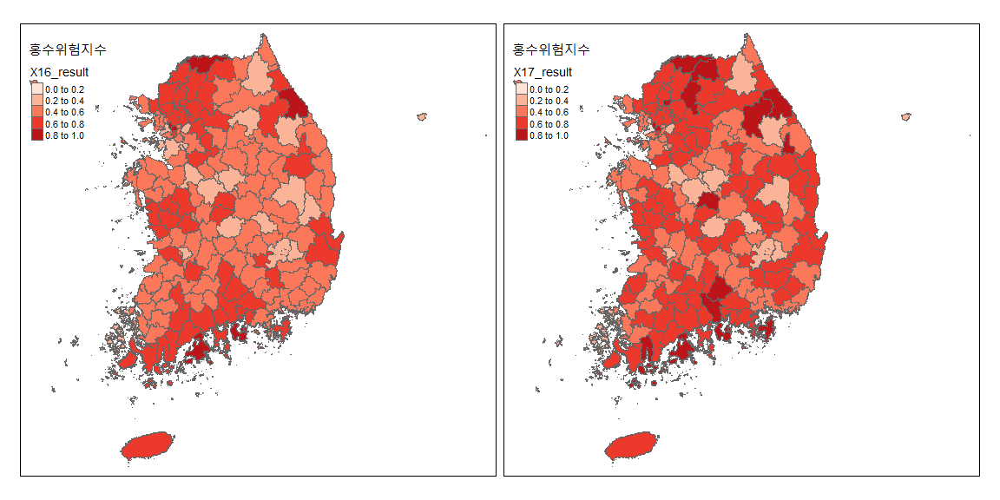
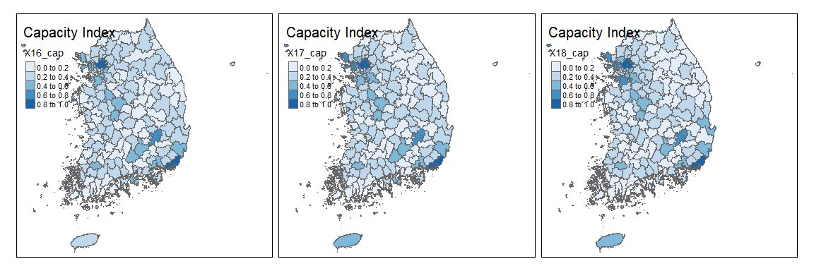
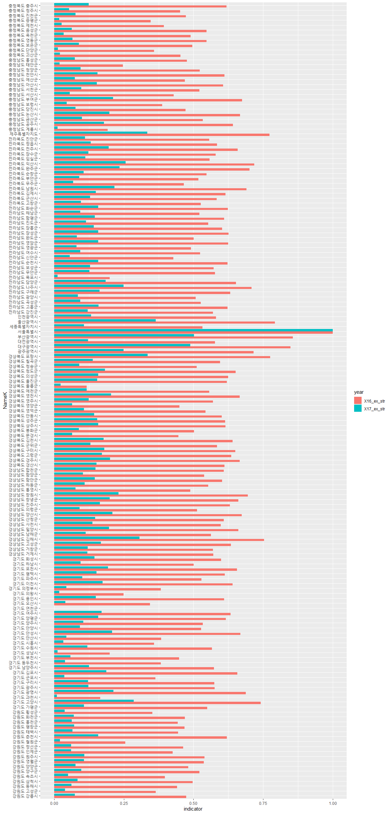

```r
library(rgdal)
library(sf)
library(lwgeom) #st_make_valid
library(tmap)
library(tidyverse)
```

#### **열 명칭별 의미**
모든 항목 및 지표들은 표준화 적용 완료

* Name : 영문 시군명 (161개)
* NameK : 국문 시군명 (161개)
* SGG : 시군코드 
* X16_hazard : 16년도 hazard 지수(확률강우량) X16~18 
* X16_ex : 16년도 exposure 지수 X16~17
* X16_ex_str : 16년도 총건축물수 (normal) X16~17
* X16_ex_pop : 16년도 총인구수 (noamal) X16~17
* X16_ex_eco : 16년도 평균공시지가 (noamal) X16~17
* X16_vul : 16년도 vulnerability 지수  X16~17
* X16_vul_phy : 16년도 노후건축물비율 (normal) X16~17
* X16_vul_soc : 16년도 의존인구비율 (normal) X16~17
* X16_cap : 16년도 capacity 지수 X16~18
* X16_cap_phy : 16년도 방재시설 개수 (normal) X16~17
* X16_cap_soc : 16년도 소방경찰관서수 밀도 (normal) X16~17
* X16_cap_eco : 16년도 방재예산액 (normal) X16~17
* X16_result : 16년도 홍수피해위험지수 X16~17
 


```r
# 시군 shp file 불러오기
analysis <- rgdal::readOGR('input/analysis.shp')
```

```
## OGR data source with driver: ESRI Shapefile 
## Source: "C:\00_R\0_Git\KRM_Qual\input\analysis.shp", layer: "analysis"
## with 161 features
## It has 34 fields
```

```r
analysis_sf <- st_as_sf(analysis)
# polygon error check
# st_is_valid(analysis_sf)
analysis_sf <- st_make_valid(analysis_sf)
# st_is_valid(analysis_sf)
# tmap loading 과 그림속도 증가를 위해 polygon simplify
analysis_simp <- st_simplify(analysis_sf, dTolerance = 50)
```

속성 확인


```r
summary(analysis_simp)
```

```
##                     Name               NameK          SGG       
##  Busan                :  1   강원도 강릉시:  1   Min.   :11000  
##  Chungbuk Boeun-gun   :  1   강원도 고성군:  1   1st Qu.:42130  
##  Chungbuk Cheongju-si :  1   강원도 동해시:  1   Median :44800  
##  Chungbuk Chungju-si  :  1   강원도 삼척시:  1   Mean   :44074  
##  Chungbuk Danyang-gun :  1   강원도 속초시:  1   3rd Qu.:47130  
##  Chungbuk Eumseong-gun:  1   강원도 양구군:  1   Max.   :50000  
##  (Other)              :155   (Other)      :155                  
##    X16_hazard       X17_hazard       X18_hazard         X16_ex      
##  Min.   :0.0000   Min.   :0.0000   Min.   :0.0000   Min.   :0.0000  
##  1st Qu.:0.3315   1st Qu.:0.3045   1st Qu.:0.3383   1st Qu.:0.2980  
##  Median :0.4577   Median :0.4459   Median :0.4473   Median :0.3624  
##  Mean   :0.4726   Mean   :0.4633   Mean   :0.4756   Mean   :0.3908  
##  3rd Qu.:0.6327   3rd Qu.:0.6444   3rd Qu.:0.6497   3rd Qu.:0.4641  
##  Max.   :1.0000   Max.   :1.0000   Max.   :1.0000   Max.   :1.0000  
##                                                                     
##    X16_ex_str       X16_ex_pop        X16_ex_eco          X17_ex      
##  Min.   :0.0000   Min.   :0.00000   Min.   :0.00000   Min.   :0.0000  
##  1st Qu.:0.4745   1st Qu.:0.02819   1st Qu.:0.03119   1st Qu.:0.2917  
##  Median :0.5625   Median :0.04499   Median :0.06407   Median :0.3545  
##  Mean   :0.5442   Mean   :0.06534   Mean   :0.11451   Mean   :0.3871  
##  3rd Qu.:0.6235   3rd Qu.:0.07590   3rd Qu.:0.13962   3rd Qu.:0.4652  
##  Max.   :1.0000   Max.   :1.00000   Max.   :1.00000   Max.   :1.0000  
##                                                                       
##    X17_ex_str        X17_ex_pop        X17_ex_eco         X16_vul      
##  Min.   :0.00000   Min.   :0.00000   Min.   :0.00000   Min.   :0.0000  
##  1st Qu.:0.07373   1st Qu.:0.02774   1st Qu.:0.03182   1st Qu.:0.4964  
##  Median :0.11647   Median :0.04474   Median :0.06387   Median :0.6438  
##  Mean   :0.13016   Mean   :0.06522   Mean   :0.11387   Mean   :0.6282  
##  3rd Qu.:0.15786   3rd Qu.:0.07592   3rd Qu.:0.14112   3rd Qu.:0.8002  
##  Max.   :1.00000   Max.   :1.00000   Max.   :1.00000   Max.   :1.0000  
##                                                                        
##   X16_vul_phy      X16_vul_soc        X17_vul        X17_vul_phy    
##  Min.   :0.0000   Min.   :0.0000   Min.   :0.0000   Min.   :0.0000  
##  1st Qu.:0.5693   1st Qu.:0.2111   1st Qu.:0.4605   1st Qu.:0.5715  
##  Median :0.7327   Median :0.3663   Median :0.6247   Median :0.7283  
##  Mean   :0.6768   Mean   :0.3565   Mean   :0.6114   Mean   :0.6757  
##  3rd Qu.:0.8275   3rd Qu.:0.4832   3rd Qu.:0.7778   3rd Qu.:0.8286  
##  Max.   :1.0000   Max.   :1.0000   Max.   :1.0000   Max.   :1.0000  
##                                                                     
##   X17_vul_soc        X16_cap        X16_cap_phy      X16_cap_soc     
##  Min.   :0.0000   Min.   :0.0000   Min.   :0.0000   Min.   :0.00000  
##  1st Qu.:0.3343   1st Qu.:0.1757   1st Qu.:0.1860   1st Qu.:0.05982  
##  Median :0.5139   Median :0.2329   Median :0.2390   Median :0.09030  
##  Mean   :0.5127   Mean   :0.2577   Mean   :0.2844   Mean   :0.13897  
##  3rd Qu.:0.7093   3rd Qu.:0.3168   3rd Qu.:0.3320   3rd Qu.:0.14980  
##  Max.   :1.0000   Max.   :1.0000   Max.   :1.0000   Max.   :1.00000  
##                                                                      
##   X16_cap_eco        X17_cap        X17_cap_phy      X17_cap_soc     
##  Min.   :0.0000   Min.   :0.0000   Min.   :0.0000   Min.   :0.00000  
##  1st Qu.:0.1400   1st Qu.:0.1555   1st Qu.:0.1860   1st Qu.:0.05833  
##  Median :0.2000   Median :0.2224   Median :0.2390   Median :0.08718  
##  Mean   :0.2212   Mean   :0.2608   Mean   :0.2828   Mean   :0.13758  
##  3rd Qu.:0.2800   3rd Qu.:0.3251   3rd Qu.:0.3230   3rd Qu.:0.15817  
##  Max.   :1.0000   Max.   :1.0000   Max.   :1.0000   Max.   :1.00000  
##                                                                      
##   X17_cap_eco        X18_cap        X18_cap_phy      X18_cap_soc     
##  Min.   :0.0000   Min.   :0.0000   Min.   :0.0000   Min.   :0.00000  
##  1st Qu.:0.1435   1st Qu.:0.1486   1st Qu.:0.1925   1st Qu.:0.07029  
##  Median :0.2088   Median :0.2186   Median :0.2526   Median :0.10522  
##  Mean   :0.2418   Mean   :0.2526   Mean   :0.2915   Mean   :0.15205  
##  3rd Qu.:0.2896   3rd Qu.:0.3255   3rd Qu.:0.3395   3rd Qu.:0.16772  
##  Max.   :1.0000   Max.   :1.0000   Max.   :1.0000   Max.   :1.00000  
##                                                                      
##   X18_cap_eco       X16_result       X17_result              geometry  
##  Min.   :0.0000   Min.   :0.0000   Min.   :0.0000   MULTIPOLYGON : 51  
##  1st Qu.:0.1380   1st Qu.:0.4523   1st Qu.:0.5133   POLYGON      :110  
##  Median :0.2162   Median :0.5595   Median :0.6350   epsg:NA      :  0  
##  Mean   :0.2476   Mean   :0.5540   Mean   :0.6121   +proj=tmer...:  0  
##  3rd Qu.:0.3159   3rd Qu.:0.6503   3rd Qu.:0.7190                      
##  Max.   :1.0000   Max.   :1.0000   Max.   :1.0000                      
## 
```

```r
str(analysis_simp)
```

```
## Classes 'sf' and 'data.frame':	161 obs. of  35 variables:
##  $ Name       : Factor w/ 161 levels "Busan","Chungbuk Boeun-gun",..: 33 34 32 41 42 45 46 47 44 38 ...
##  $ NameK      : Factor w/ 161 levels "강원도 강릉시",..: 1 2 3 4 5 6 7 8 9 10 ...
##  $ SGG        : num  42150 42820 42170 42230 42210 ...
##  $ X16_hazard : num  1 0.526 0.612 0.451 0.526 ...
##  $ X17_hazard : num  1 0.546 0.604 0.441 0.546 ...
##  $ X18_hazard : num  1 0.615 0.594 0.439 0.615 ...
##  $ X16_ex     : num  0.304 0.194 0.381 0.264 0.358 ...
##  $ X16_ex_str : num  0.475 0.364 0.441 0.498 0.398 ...
##  $ X16_ex_pop : num  0.0273 0.0127 0.0588 0.0267 0.0354 ...
##  $ X16_ex_eco : num  0.0518 0.0326 0.0956 0.0207 0.1254 ...
##  $ X17_ex     : num  0.324 0.188 0.379 0.263 0.357 ...
##  $ X17_ex_str : num  0.0743 0.0388 0.062 0.0839 0.0494 ...
##  $ X17_ex_pop : num  0.0387 0.0123 0.0583 0.0266 0.0349 ...
##  $ X17_ex_eco : num  0.052 0.032 0.094 0.0202 0.1251 ...
##  $ X16_vul    : num  0.544 0.66 0.372 0.436 0.463 ...
##  $ X16_vul_phy: num  0.569 0.665 0.63 0.464 0.557 ...
##  $ X16_vul_soc: num  0.3416 0.4142 0.0328 0.291 0.2383 ...
##  $ X17_vul    : num  0.435 0.644 0.369 0.454 0.421 ...
##  $ X17_vul_phy: num  0.547 0.664 0.675 0.47 0.522 ...
##  $ X17_vul_soc: num  0.3343 0.5812 0.0906 0.4442 0.3343 ...
##  $ X16_cap    : num  0.202 0.252 0.225 0.154 0.127 ...
##  $ X16_cap_phy: num  0.202 0.156 0.15 0.207 0.064 0.181 0.191 0.169 0.316 0.492 ...
##  $ X16_cap_soc: num  0.0497 0.0464 0.1755 0.0331 0.1724 ...
##  $ X16_cap_eco: num  0.28 0.43 0.25 0.19 0.14 0.22 0.25 0.31 0.24 0.17 ...
##  $ X17_cap    : num  0.1441 0.2496 0.1555 0.1269 0.0874 ...
##  $ X17_cap_phy: num  0.235 0.323 0.15 0.202 0.064 0.181 0.192 0.169 0.313 0.493 ...
##  $ X17_cap_soc: num  0.0456 0.0422 0.1721 0.0332 0.1689 ...
##  $ X17_cap_eco: num  0.133 0.273 0.115 0.141 0.059 ...
##  $ X18_cap    : num  0.1129 0.099 0.1557 0.0966 0.0775 ...
##  $ X18_cap_phy: num  0.24 0.1571 0.1504 0.2029 0.0642 ...
##  $ X18_cap_soc: num  0.0589 0.0526 0.2033 0.0495 0.2245 ...
##  $ X18_cap_eco: num  0.0914 0.1508 0.1288 0.1029 0.0254 ...
##  $ X16_result : num  0.81 0.488 0.496 0.406 0.546 ...
##  $ X17_result : num  0.9 0.562 0.609 0.494 0.637 ...
##  $ geometry   :sfc_GEOMETRY of length 161; first list element: List of 4
##   ..$ :List of 1
##   .. ..$ : num [1:4, 1:2] 1117170 1117306 1117157 1117170 1988756 ...
##   ..$ :List of 1
##   .. ..$ : num [1:522, 1:2] 1117212 1117241 1117154 1116898 1117010 ...
##   ..$ :List of 1
##   .. ..$ : num [1:5, 1:2] 1127796 1127817 1128087 1127823 1127796 ...
##   ..$ :List of 1
##   .. ..$ : num [1:4, 1:2] 1121260 1121173 1121342 1121260 1982267 ...
##   ..- attr(*, "class")= chr  "XY" "MULTIPOLYGON" "sfg"
##  - attr(*, "sf_column")= chr "geometry"
##  - attr(*, "agr")= Factor w/ 3 levels "constant","aggregate",..: NA NA NA NA NA NA NA NA NA NA ...
##   ..- attr(*, "names")= chr  "Name" "NameK" "SGG" "X16_hazard" ...
```

```r
tm_shape(analysis_simp)+
  tm_fill("NameK")+
  tm_borders()+
  tmap_options(max.categories = 161)+
  tm_layout(legend.position = c("right", "bottom"), inner.margins = 0.05)
```

<!-- -->

**분류**


```r
result <- c("X16_result", "X17_result")
haz <- c("X16_hazard", "X17_hazard", "X18_hazard")
expo <- c("X16_ex", "X17_ex")
vul <- c("X16_vul", "X17_vul")
cap <- c("X16_cap", "X17_cap", "X18_cap")
```

# Risk = (Hazard * Exposure * Vulnerability ) / Capacity
**Risk 요소별 Normalization 후 결과 분포**


```r
breaks <-  c(0, 0.2, 0.4, 0.6, 0.8, 1)
tm_shape(analysis_simp)+
  tm_polygons(result, breaks=breaks, palette="Reds")+
  tm_layout(title = "홍수위험지수")+
  tm_facets(nrow=1)
```

<!-- -->

```r
tm_shape(analysis_simp)+
  tm_polygons(haz, breaks=breaks, palette="Oranges")+
  tm_layout(title = "Hazard Index")+
  tm_facets(nrow=1)
```

<!-- -->

```r
tm_shape(analysis_simp)+
  tm_polygons(expo, breaks=breaks, palette="Greens")+
  tm_layout(title="Exposure Index")+
  tm_facets(nrow=1)
```

<!-- -->

```r
tm_shape(analysis_simp)+
  tm_polygons(vul, breaks=breaks)+
  tm_layout(title="Vulnerability Index")+
  tm_facets(nrow=1)
```

<!-- -->

```r
tm_shape(analysis_simp)+
  tm_polygons(cap, breaks=breaks, palette="Blues")+
  tm_layout(title="Capacity Index")+
  tm_facets(nrow=1)
```

<!-- -->

# Risk요소 161개 지자체 순위 
Geometry를 제거하고 분석을 시작하였다. HTML출력을 위해 각 출력마다의 `fig.width`
`fig.height`를 달리하였다. 


```r
analysis_df <- st_drop_geometry(analysis_simp)
```

```r
# hazard 지수
analysis_df %>% 
  select(NameK, all_of(haz)) %>% 
  pivot_longer(all_of(haz), names_to="year", values_to="indicator") %>% 
  group_by(NameK) %>% 
  summarise(mean=mean(indicator)) %>% 
  ggplot(aes(
    x=reorder(NameK, mean, FUN=desc),
    y=mean))+
  geom_point()+
  coord_flip()+
  labs(title = "Hazard Index")
```

<!-- -->

```r
# exposure 지수
analysis_df %>% 
  select(NameK, all_of(expo)) %>% 
  pivot_longer(all_of(expo), names_to="year", values_to="indicator") %>% 
  group_by(NameK) %>% 
  summarise(mean=mean(indicator)) %>% 
  ggplot(aes(
    x=reorder(NameK, mean, FUN=desc),
    y=mean))+
  geom_point()+
  coord_flip()+
  labs(title = "Exposure Index")
```

<!-- -->

```r
# vulnerability 지수
analysis_df %>% 
  select(NameK, all_of(vul)) %>% 
  pivot_longer(all_of(vul), names_to="year", values_to="indicator") %>% 
  group_by(NameK) %>% 
  summarise(mean=mean(indicator)) %>% 
  ggplot(aes(
    x=reorder(NameK, mean, FUN=desc),
    y=mean))+
  geom_point()+
  coord_flip()+
  labs(title = "Vulnerability Index")
```

<!-- -->

```r
# capacity 지수
analysis_df %>% 
  select(NameK, all_of(cap)) %>% 
  pivot_longer(all_of(cap), names_to="year", values_to="indicator") %>% 
  group_by(NameK) %>% 
  summarise(mean=mean(indicator)) %>% 
  ggplot(aes(
    x=reorder(NameK, mean, FUN=desc),
    y=mean))+
  geom_point()+
  coord_flip()+
  labs(title = "Capacity Index")
```

<!-- -->

```r
# 홍수피해위험지수
analysis_df %>% 
  select(NameK, all_of(result)) %>% 
  pivot_longer(all_of(result), names_to="year", values_to="indicator") %>% 
  group_by(NameK) %>% 
  summarise(mean=mean(indicator)) %>% 
  ggplot(aes(
    x=reorder(NameK, mean, FUN=desc),
    y=mean))+
  geom_point()+
  coord_flip()+
  labs(title = "홍수피해위험지수")
```

<!-- -->

# 각 indicator들의 분포


```r
# 총건축물
analysis_df %>% 
  select(NameK, c(X16_ex_str, X17_ex_str)) %>% 
  pivot_longer(c(X16_ex_str, X17_ex_str),
               names_to="year", values_to="indicator") %>% 
  group_by(NameK) %>% 
  ggplot(aes(NameK,indicator))+
  geom_col(aes(color=year))+
  coord_flip()
```

<!-- -->


---
title: "KRM_Qual.R"
author: "Kyungtak Kim"
date: "2020-03-26"
---

